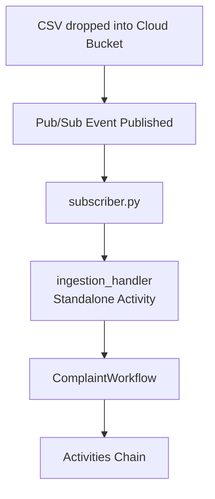
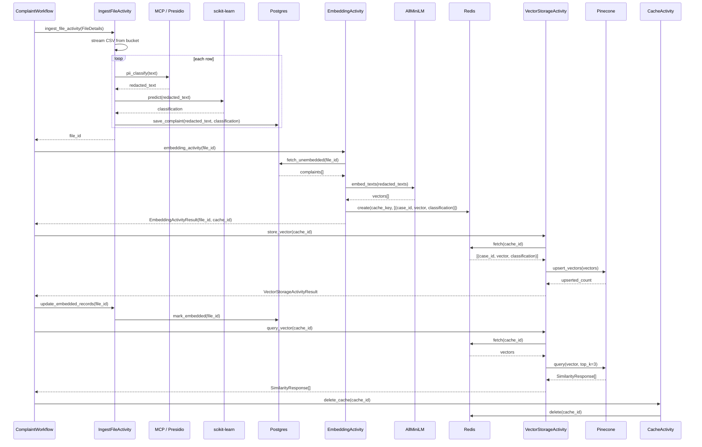

## Diagram (High Level)

```mermaid
flowchart TD
    A[CSV dropped into Cloud Bucket] --> B[Pub/Sub Event Published]
    B --> C[subscriber.py]
    C --> D[ingestion_handler\nStandalone Activity]
    D --> E[ComplaintWorkflow]
    E --> F[Activities Chain]
```

## Diagram (Detailed)

```mermaid
sequenceDiagram
    participant W as ComplaintWorkflow
    participant IA as IngestFileActivity
    participant MCP as MCP / Presidio
    participant ML as scikit-learn
    participant PG as Postgres
    participant EA as EmbeddingActivity
    participant EM as AllMiniLM
    participant RC as Redis
    participant VS as VectorStorageActivity
    participant PC as Pinecone
    participant CA as CacheActivity

    W->>IA: ingest_file_activity(FileDetails)
    IA->>IA: stream CSV from bucket
    loop each row
        IA->>MCP: pii_classify(text)
        MCP-->>IA: redacted_text
        IA->>ML: predict(redacted_text)
        ML-->>IA: classification
        IA->>PG: save_complaint(redacted_text, classification)
    end
    IA-->>W: file_id

    W->>EA: embedding_activity(file_id)
    EA->>PG: fetch_unembedded(file_id)
    PG-->>EA: complaints[]
    EA->>EM: embed_texts(redacted_texts)
    EM-->>EA: vectors[]
    EA->>RC: create(cache_key, [(case_id, vector, classification)])
    EA-->>W: EmbeddingActivityResult(file_id, cache_id)

    W->>VS: store_vector(cache_id)
    VS->>RC: fetch(cache_id)
    RC-->>VS: [(case_id, vector, classification)]
    VS->>PC: upsert_vectors(vectors)
    PC-->>VS: upserted_count
    VS-->>W: VectorStorageActivityResult

    W->>IA: update_embedded_records(file_id)
    IA->>PG: mark_embedded(file_id)

    W->>VS: query_vector(cache_id)
    VS->>RC: fetch(cache_id)
    RC-->>VS: vectors
    VS->>PC: query(vector, top_k=3)
    PC-->>VS: SimilarityResponse[]
    VS-->>W: SimilarityResponse[]

    W->>CA: delete_cache(cache_id)
    CA->>RC: delete(cache_id)
```